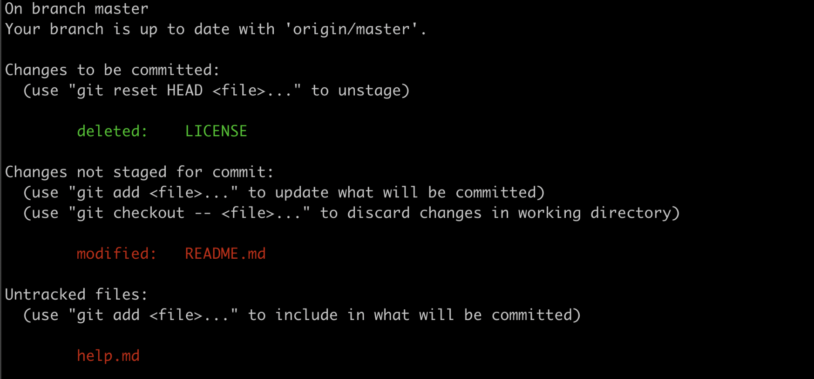

# master-git

Overview git command line.

**git init**:

- Khởi tạo một local repo mới
- Tạo ra một thư mục con (ẩn) tên .git, thư mục này chứa tất cả thông tin mô tả cho kho chứa dự án (Repo) mới

**git clone**:

- Tạo ra một bản sao của 1 repo khác.

```shell

# Clone source code
git clone git@github.com:suupham2506/master-git.git

# Copy Repo từ thư mục này sang thư mục khác
git clone path-git path-des
```

**git remote**:

## Trỏ 1 local repo đến 1 remote repo:

```shell

# Giả sử có 1 repo url
git remote add remote-name(origin) url
```

## Xóa trỏ 1 remote repo:

```shell

# Giả sử có 1 repo url
git remote rm remote-name
```

## Đổi tên địa chỉ remote:

```shell

# Giả sử có 1 repo url
git remote rename ten-cu ten-moi
```

## Xem thông tin về Remote:

```shell

# Giả sử có 1 repo url
git remote show origin
```

**git add**:

- Thực hiện lệnh tạo snapshot, lưu thông tin thay đổi vào vùng staging để chuẩn bị cho lệnh commit

```shell

# Add từng file
git add file1 file2 dir1 dir2

# Add toàn bộ
git add .
```

**git restore --staged**:

- Hoàn tác file vừa add

```shell

# Giả sử vừa add file README.md
git restore --staged README.md
git reset HEAD <file>
git reset
git reset -- filename
```

**git status**:

- Sử dụng lệnh git để biết thông tin trạng thái sửa đổi, thêm mới, xóa các file trước khi thực hiện commit



**git commit**:

- Thực hiện câu lệnh git commit để lưu dữ liệu vào hệ thống Git, tùy chọn các tham số như tự động staging, cập nhật vào commit cuối

```shell

# thực hiện với tham số -m để kèm dòng thông tin về commit
git commit -m "Ghi chú về commit"

# tham số -a thì nó tương đương thực hiện lệnh git add để đưa các file đang được giám sát có sự thay đổi vào staging rồi tự động chạy git commit

git commit -a -m "Ghi chú về commit"

# Nếu commit đã được tạo ra nhưng chưa thực hiện push lên remote (khi có làm việc với Remote Repo) thì bạn có thể tạo ra commit mới thay thế cho commit cuối cùng đó. Dùng trong trường hợp không muốn tạo ra nhiều commit trong lịch sử commit thì cho vào lệnh tham số --amend

git commit --amend -m "Thông tin về commit"
```

**git log**:

- Tìm kiếm, xem lại, lọc các thông tin log lịch sử commit trên git bằng lệnh git log với các thiết lập khác nhau, như pretty, hiện thị đồ thị log

```shell

# xem log 1 dòng
git log --oneline

# Lọc theo ngày
git log --after="2019-1-1" --before="2019-12-31"

# Lọc theo người commit
git log --oneline --author="Suu Pham"

# Lọc theo thông tin ghi chú về commit
git log --oneline --grep="init"

# Định dạng format log
git log --pretty=format:"%h - %ad  %s" --date="short"
```

**git diff**:

- Hiện thị thông tin thay đổi giữa thư mục làm việc và vùng index (staging) hoặc với commit cũ, thông tin thay đổi giữa index(staging) và commit, thông tin thay đổi giữa hai nhánh

```shell

# Khi có sự thay đổi của thư mục làm việc mà chưa chỉ mục, thì có thể xem sự thay đổi của nó với commit cuối
git diff

# Kiểm tra sự thay đổi của index (staging) với commit cuối
git diff --staged

# Kiểm tra thay đổi giữa hai commit
git diff hash-commit1 hash-commit2

# Kiểm tra sự thay đổi của hai nhánh
git diff branch1 branch2
```

**git branch**:

```shell
# tạo nhánh mới
git branch branch_name

# chuyển nhánh
git checkout branch_name

# tạo và chuyển nhánh
git branch -b branch_name

# xóa branch
git branch -d branch_name

# đổi tên branch
git branch -m new_branch_name

# đổi tên nếu đang ở nhánh khác
git branch -m old-name new-name
```

**git rebase**:

- Thay đổi lịch sử commit

```shell

git rebase -i HEAD~N

# Trong danh sách commit có thể chọn các thiết lập như sau rồi lưu lại để thực hiện
# p hay pick thì commit đó giữ lại
# s hay squash thì sẽ sử dụng nội dung commit này nhưng đè vào commit phía trước
# r hay reword sẽ giữ lại commit nhưng cho phép viết lại nội dung thông điệp
# e hay edit sẽ chỉnh sửa commit

git commit —amend
git rebase —continue
git push -f
```

**git cherry-pick**:

- Checkout 1 commit bất kỳ tại 1 branch được chỉ định về brach hiện tại.

```shell

git checkout master

git cherry-pick feature-A~1

# Hoặc chúng ta có thể chỉ định hash commit
git cherry-pick C2

# Nếu muốn thêm 1 vài commit, không liên tục
git cherry-pick commit_id1 commit_id3

# Nếu muốn thêm 1 loạt commit lần lượt cạnh nhau
git cherry-pick commit_id1...commit_id5

# Với code trên, thì  commit_id1 sẽ ko được thêm vào
# Để đưa commit được tính vào trong branch muốn thêm thì
git cherry-pick commit_id1^..commit_id5
```

**git stash**:

- Lưu changes hiện tại để thực hiện những việc khác.

```shell

# lưu 1 stash với message
git stash save "Toi dang Code cai gi the nay"

# xem danh sách stash
git stash list

# sử dụng lại stash đã lưu
git stash apply
git stash apply stash@{1}

# giống như git stash apply nhưng đồng thời xóa luôn stash
git stash pop
git stash pop stash@{1}

# xem lại những gì đã stash
git stash show
git stash show -p (full hd)
git stash show stash@{1}

# xóa toàn bộ stash
git stash clear

# xóa stash gần nhất
git stash drop
git stash drop stash@{1}
```
